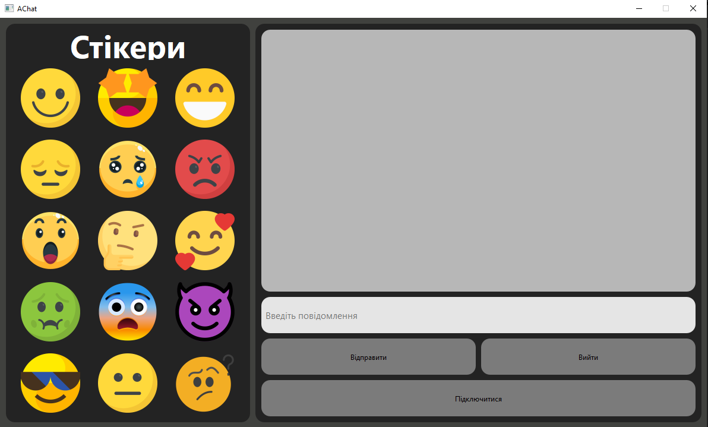
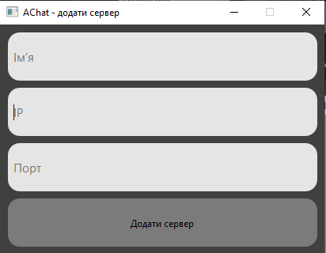

# AChat
AChat - це безкоштовний та open-source чат на Python.

# Можливості
- Ширфування. Всі повідомлення шифруються, тому зловмисник не зможе їх прочитати
- Відправка повідомленнь
- У кожного користувача є унікальний нікнейм
- Доступ до чату мають тільки ті люди, які знають IP та порт сервера, та мають доступ до клієнту
- Відкритий вихідний код

# Демонстрація ПЗ

# Ліцензія
Проект використовує MIT-ліцензію. Це означає, що ви можете використовувати, копіювати, модифікувати та розповсюджувати вихідний код.

Повна ліцензія у файлі <a href="LICENSE">LICENSE</a>